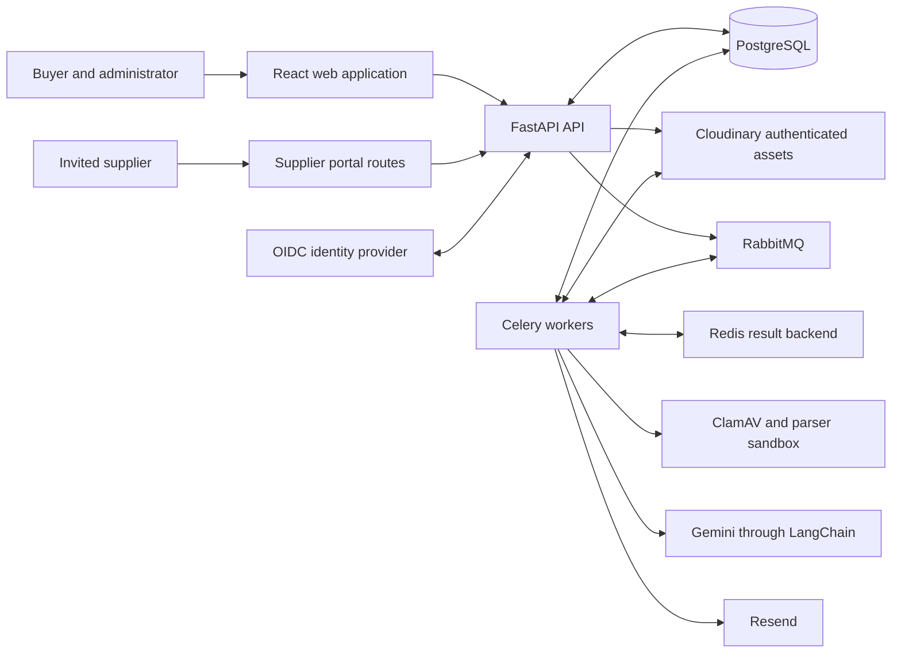
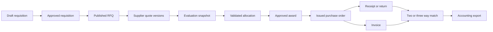
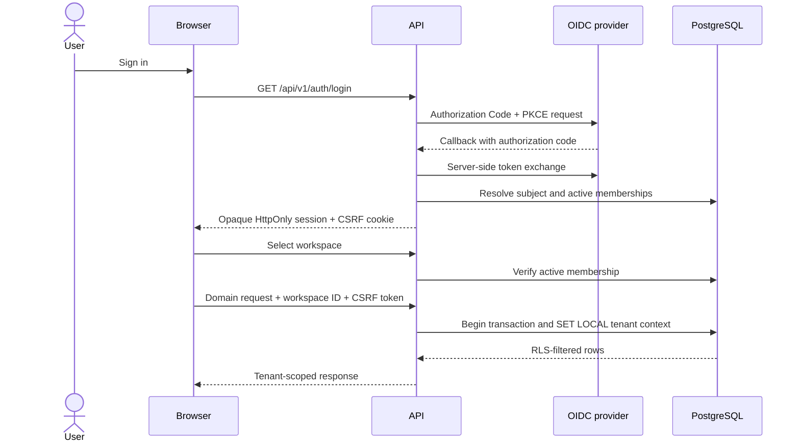
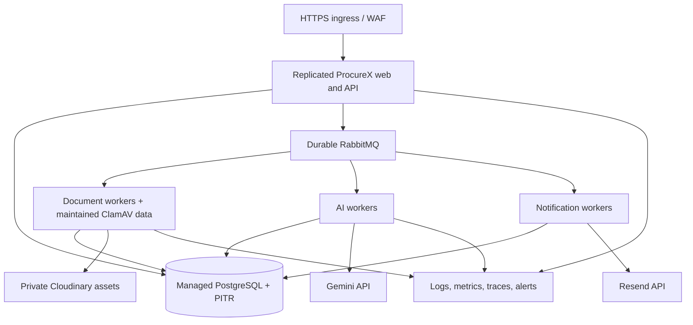

# ProcureX architecture

This document describes the implemented ProcureX system, its component boundaries, major runtime
flows, and deployment model. Product rules and endpoint details live in the focused documents under
[`docs/`](docs/PROJECT.md).

## 1. Architectural goals

ProcureX is built to make procurement decisions reproducible and safe across tenant boundaries.
The architecture follows these rules:

1. PostgreSQL is authoritative for business state, authorization metadata, and workflow history.
2. Deterministic code owns eligibility, money, scoring, optimization constraints, and approvals.
3. AI may propose cited analysis, but it cannot approve, award, issue an order, or move money.
4. Every organization boundary is enforced in HTTP authorization, database policies, file access,
   background work, and AI evidence retrieval.
5. Published and approved artifacts use immutable revisions or content digests.
6. Asynchronous work is replay safe because jobs and side effects use stable idempotency keys.
7. External providers sit behind local adapters; their payload types do not become domain models.

## 2. System context



The buyer workspace and supplier pages are one React build. FastAPI exposes `/api/v1`, owns the
authentication boundary, and can serve the compiled frontend for a same-origin deployment.
PostgreSQL holds all authoritative records. Cloudinary holds file bytes. Celery workers execute
malware scanning, parsing, notification, and AI jobs outside request transactions.

## 3. Architectural style

The backend is a **modular monolith with independently deployable workers**. Domains share one
codebase and database, while each domain owns its SQLAlchemy models, schemas, services, and
business rules. HTTP routes translate transport data and delegate mutations to application
services. Cross-domain changes occur through explicit service calls inside database transactions.

This structure keeps transactional procurement rules together while allowing expensive or risky
work to scale separately. The asynchronous boundary is Celery rather than a network boundary
between domain services.

### Layer responsibilities

| Layer | Location | Responsibility |
|---|---|---|
| Presentation | `frontend/src` | Buyer workspace, supplier pages, routing, forms, API cache |
| HTTP transport | `backend/app/api/v1/routes` | Authentication dependencies, request parsing, status codes |
| Contracts | `backend/app/schemas` | Validated request, response, and command shapes |
| Application | `backend/app/services` | Permissions, state transitions, transactions, audit/outbox writes |
| Domain data | `backend/app/models` | Persistence models, enums, keys, and relational invariants |
| Specialized logic | `backend/app/graphs`, `optimization` | Bounded AI workflows and deterministic allocation |
| Infrastructure | `backend/app/core`, `db`, `auth` | Settings, sessions, tenancy, files, email, HTTP security |
| Asynchronous execution | `backend/app/workers` | Durable task entry points, scanning, parsing, AI, notifications |
| Schema evolution | `backend/alembic` | Ordered PostgreSQL migrations and RLS policies |

## 4. Runtime components

### React application

The frontend uses React Router for buyer, administrator, and supplier journeys. TanStack Query owns
server-state fetching and invalidation. In local mode, users provide development organization and
user IDs. In deployed mode, browser requests use an opaque HttpOnly session cookie created by the
backend OIDC flow. Provider tokens and server credentials never enter the React runtime.

The production container builds the frontend and copies it into `frontend_dist`. FastAPI serves
static assets and returns `index.html` for client routes, giving the web app and API one origin.

### FastAPI edge

`backend/app/main.py` creates the application, mounts the versioned router, and configures:

- exact trusted-host and CORS allowlists;
- request rate limiting;
- correlation IDs, security headers, timing, and slow/error logging;
- `/health/live` and PostgreSQL-backed `/health/ready` probes; and
- local API documentation, disabled in production.

Routes are intentionally thin. Service functions load the authenticated tenant context, verify
permissions and expected versions, lock rows where necessary, enforce state transitions, and write
the business record together with audit/outbox data.

### PostgreSQL

PostgreSQL stores identity, memberships, roles, procurement state, document metadata, extraction
evidence, AI run metadata, durable jobs, audit events, and outbox events. SQLAlchemy uses async
sessions; Alembic owns schema changes.

Organization-owned tables contain a non-null `organization_id`. Forced row-level security reads
the active organization from the transaction-local `app.current_organization_id` setting. Runtime
database roles must be `NOSUPERUSER`, must not own the tables, and must not have `BYPASSRLS`.

### Cloudinary

Cloudinary stores original file bytes as authenticated, create-only assets. PostgreSQL stores
stable asset identities and metadata rather than durable delivery URLs. Upload signatures and
short-lived download URLs are generated only after API authorization. Cloudinary never decides
whether a user may access a document.

### Celery, RabbitMQ, and Redis

RabbitMQ provides at-least-once task delivery and Redis is the Celery result backend. Workers use
late acknowledgement, worker-loss rejection, a prefetch multiplier of one, bounded retries, and
database idempotency records.

| Queue | Work |
|---|---|
| `documents.security` | Re-download, byte/digest verification, ClamAV scan |
| `documents.parsing` | Sandboxed native extraction and OCR |
| `ai.evaluations` | Evidence retrieval and LangGraph evaluation analysis |
| `notifications.email` | Member and supplier invitation delivery |

The free Render demo uses eager task mode and runs tasks in the API process. Broker mode with
dedicated workers is the intended customer topology.

### AI and optimization

LangChain adapts Gemini structured output. LangGraph coordinates bounded execution, PostgreSQL
checkpoints, and human-review interrupts. Graph state carries identifiers and derived structured
data, while authorized evidence is retrieved from PostgreSQL for each model invocation.

OR-Tools CP-SAT solves allocation independently of the language model. Feasible results are checked
again against the original constraints before they can enter an award dossier.

## 5. Domain modules

| Domain | Main responsibilities |
|---|---|
| Identity | Organizations, users, memberships, roles, permissions, settings, sessions |
| Commercial | Subscription entitlement, support, export, closure, after-sales |
| Requisitions | Purchase requests, line items, requirements, immutable revisions |
| Approvals and budgets | Policies, quorum decisions, reservations, append-only ledger |
| Suppliers | Profiles, contacts, qualification, certificates, approval state |
| Sourcing | RFQs, publications, invitations, quote versions, clarifications |
| Documents | Upload intents, assets, quarantine, scans, parses, pages |
| Extractions | Structured fields, evidence anchors, human review history |
| Evaluations | Requirement matrix, eligibility, exact costs, deterministic score |
| AI analysis | Analysis runs, model invocations, cited narrative, review interrupt |
| Allocation and awards | Solver scenarios, allocations, award dossiers, decisions |
| Operations | POs, amendments, receipts, returns, invoices, matching, exports |
| Platform | Durable jobs, outbox events, append-only audit events |

The normal aggregate progression is:



Every arrow is guarded by permissions and state rules. Several transitions also bind the source
version or SHA-256 digest so changed upstream data makes downstream approval stale.

## 6. Request, identity, and tenant flow



Local and test environments may replace OIDC with explicit development headers. Configuration
validation prevents that mode in staging and production. Supplier invitation and order links use a
separate constrained access flow scoped to the named organization and record.

## 7. Transaction and consistency model

- Each application command executes inside one database transaction.
- Optimistic `version` fields reject concurrent edits to mutable aggregates.
- Approval decisions and budget ledger entries are append only.
- Budget reservation locks the budget row, checks the derived available balance, and records
  balanced ledger entries in the same transaction as final approval.
- RFQ publications, quote submissions, evaluations, allocation scenarios, and award dossiers keep
  immutable snapshots or canonical content digests.
- Unique command/idempotency keys prevent duplicate jobs, purchase orders, and accounting exports.
- Business changes write audit records and, where needed, outbox records atomically with state.
- Workers assume at-least-once delivery and treat replay as a normal condition.

## 8. Secure document flow

```mermaid
sequenceDiagram
    participant Web
    participant API
    participant Cloud as Cloudinary
    participant Queue as RabbitMQ
    participant Worker
    participant DB as PostgreSQL

    Web->>API: Request upload intent
    API->>DB: Reserve immutable document version
    API-->>Web: Signed, expiring upload parameters
    Web->>Cloud: Upload authenticated create-only asset
    Web->>API: Complete upload with provider response
    API->>API: Verify signature, identity, type, and declared size
    API->>DB: Record quarantined asset and idempotent scan job
    API->>Queue: Dispatch security scan
    Worker->>Cloud: Download without redirects
    Worker->>Worker: Verify byte count and SHA-256; run ClamAV
    Worker->>DB: Append scan verdict
    Worker->>Queue: Dispatch parse only when clean
    Worker->>Worker: Parse in network-denied, resource-limited subprocess
    Worker->>DB: Store immutable parse attempt and ordered pages
```

Supported intake formats are PDF, DOCX, XLSX, JPEG, and PNG. Parser failures remain recorded and a
later attempt can retry. A user download is authorized against the tenant record and allowed only
after a clean scan, then returns a short-lived authenticated URL.

Structured extraction binds proposed fields to a completed parse digest. Present values require
same-parse page evidence; critical values require human verification before finalization. Review
history records the prior value, reviewed value, actor, reason, and time.

## 9. Evaluation and AI flow

An evaluation is a deterministic, immutable comparison of the current submitted quote versions
for a closed RFQ.

1. The service builds a requirement row for every offer and requirement.
2. Mandatory `unknown` outcomes block completion; failed mandatory requirements affect eligibility.
3. Decimal arithmetic calculates landed cost and weighted scores.
4. Citations are accepted only from human-verified extracted fields in documents attached to that
   exact quote version.
5. The evaluation snapshot and all source identities receive a canonical digest.
6. An optional Celery job starts `evaluation_graph` with that evaluation ID and digest.
7. The graph retrieves tenant-authorized evidence, asks Gemini for schema-constrained analysis,
   validates every citation, and persists invocation metadata.
8. Unresolved findings pause at a human interrupt. Resume requires the original evaluation digest;
   changed source data is rejected as stale.

The model cannot change requirement outcomes, prices, eligibility, rankings, allocation, or any
approval state.

## 10. Allocation, award, and order flow

The allocation service converts normalized evaluation data and business constraints into integer
CP-SAT variables. It records optimal, feasible, or infeasible status honestly, including bounds,
gaps, and actionable conflicts. A separate validator checks each feasible allocation against item
demand, supplier capacity, minimums, split limits, supplier count, and budget constraints.

An award dossier binds the evaluation digest, allocation scenario, selected quote versions,
supplier eligibility, and approval-policy version. Quorum decisions are append only. If any bound
source changes, the pending award becomes stale.

Approved awards produce purchase orders using idempotency keys. Material amendments create a new
PO version and require renewed authorization. Receipts and returns update cumulative quantities.
Invoice matching deterministically records duplicate, quantity, price, tax, freight, currency, and
total exceptions. Only resolved and approved invoices can reach the idempotent accounting export.

## 11. Security boundaries

### Browser and API

- Deployed origins and hosts are explicit HTTPS allowlists.
- Browser sessions are opaque, HttpOnly, secure cookies with CSRF validation.
- Production disables debug output and interactive API schemas.
- Correlation IDs are sanitized and every response receives defensive browser headers.
- Rate limiting protects the HTTP edge.

### Data and authorization

- Membership and permissions are checked before domain work.
- PostgreSQL RLS is a second tenant-isolation boundary.
- Composite tenant-qualified foreign keys prevent cross-organization relationships.
- Secrets are backend-only settings and are excluded from browser builds, logs, graph state, and
  audit payloads.

### Suppliers, documents, and AI

- Invitation access is scoped to a specific organization and invitation or order.
- Uploaded bytes remain unavailable while quarantined or rejected.
- Parsers have denied network sockets and explicit CPU, memory, file, process, archive, page,
  worksheet, image, output, and time limits.
- Supplier text is treated as data, never as model or tool instructions.
- Model tools are typed, allowlisted, tenant scoped, and read only.

See [docs/SECURITY.md](docs/SECURITY.md) for the full threat model.

## 12. Deployment topologies

### Local development

```text
Vite :4173  ->  FastAPI :8000  ->  PostgreSQL :5432
                                  RabbitMQ :5672
                                  Redis :6379

Optional local Celery processes consume document, AI, and email queues.
```

### Demonstration

The Render Blueprint builds one container containing the React assets and FastAPI. A free Render
PostgreSQL instance stores state, and tasks execute eagerly inside the web service. This topology
exists for synthetic demonstrations. Its sleeping service, expiring database, memory limit, lack of
managed backups, and lack of free workers do not satisfy customer production requirements.

### Customer production target



Production requires separate migration-owner and runtime database credentials, durable brokers,
dedicated worker pools, managed secrets, encrypted backups with tested restore, provider-specific
projects, maintained malware signatures, centralized telemetry, and external acceptance drills.

## 13. Build, delivery, and verification

The multi-stage Dockerfile:

1. installs frontend dependencies with `npm ci` and builds the React application;
2. installs the locked Python graph with `uv`;
3. creates a slim runtime with ClamAV, seccomp, Poppler, and Tesseract;
4. copies application code, migrations, and compiled frontend assets; and
5. runs Uvicorn as the non-root `procurex` user.

GitHub Actions installs locked dependencies, runs Ruff and mypy, audits Python dependencies,
applies Alembic migrations to PostgreSQL, creates a least-privilege runtime role, runs the test
suite through that role, and builds the production image.

The verification strategy includes schema validation, service rules, solver checks, graph
contracts, provider adapters, document sandbox behavior, HTTP security, authentication, database
readiness and recovery tooling, tenant isolation, and end-to-end order operations.

## 14. Observability and operations

- Every request has a safe request ID and `Server-Timing` response data.
- Slow requests and server failures are logged with request correlation.
- Durable job and model invocation rows expose asynchronous execution state.
- `/health/live` checks the process; `/health/ready` checks PostgreSQL under a timeout.
- The outbox provides a durable integration boundary and audit events preserve actor history.
- Database backup, readiness, and latency/error procedures live in [`docs/runbooks/`](docs/runbooks/).

Provider delivery acceptance is not equivalent to inbox delivery, model correctness, or durable
file retention. Production monitoring must ingest provider webhooks and metrics and alert on queue
age, retries, failures, database saturation, model errors, and document-processing latency.

## 15. Scaling and evolution

The modular monolith is the deliberate starting point. Scale pressure can be handled first by:

- adding stateless API replicas;
- scaling each Celery queue independently;
- applying worker concurrency and tenant entitlement limits;
- tuning PostgreSQL pools and indexes using measured query behavior; and
- using Cloudinary for asset delivery rather than proxying file bytes through the API.

A module should become a separate service only when it needs an independent availability,
deployment, security, or scaling boundary. Its extraction point is the existing service plus
outbox contract. Splitting tables or services without such a need would weaken transactional
guarantees and increase operational cost.

## 16. Related documents

| Topic | Reference |
|---|---|
| Product scope and principles | [docs/PROJECT.md](docs/PROJECT.md) |
| Business invariants | [docs/DOMAIN.md](docs/DOMAIN.md) |
| Database and RLS | [docs/DATABASE.md](docs/DATABASE.md) |
| API contracts | [docs/API.md](docs/API.md) |
| AI graphs and evidence | [docs/AI_SYSTEM.md](docs/AI_SYSTEM.md) |
| Workflow state machines | [docs/WORKFLOWS.md](docs/WORKFLOWS.md) |
| Security controls | [docs/SECURITY.md](docs/SECURITY.md) |
| Architecture decisions | [docs/DECISIONS.md](docs/DECISIONS.md) |
| Release gates and future work | [docs/ROADMAP.md](docs/ROADMAP.md) |
| Deployment instructions | [docs/DEPLOY_RENDER.md](docs/DEPLOY_RENDER.md) |
